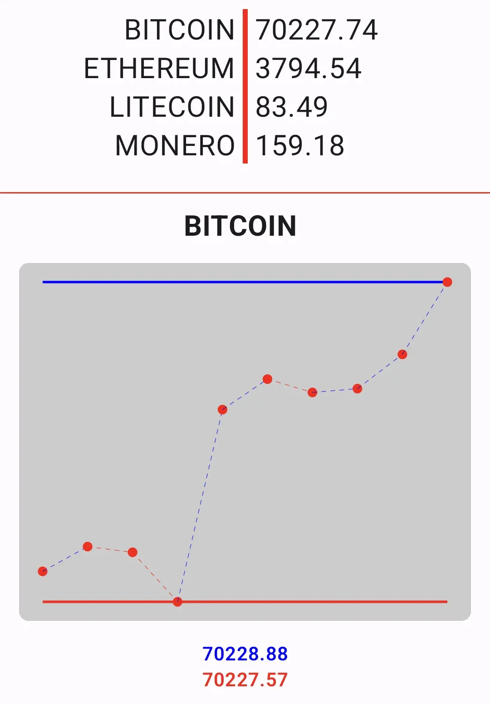

# Live Crypto Coins Android

Android application for investigating the live prices of major cryptocurrencies.
It draws a line graph for Bitcoin's price dynamics. The app uses a WebSocket connection
to receive the latest data immediately.

## Application

## Technologies used

This project can also be used as an example of using various Android technologies:

- Ktor
- WebSocket
- Jetpack Compose
- Koin DI
- Coroutines / Flow
- MVVM
